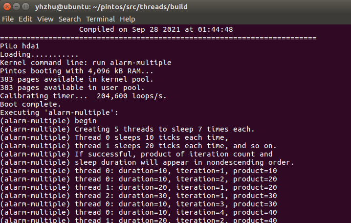

# Pintos 环境搭建

> Author: Muyung, YinghaoZhu

## 依赖安装

我所使用的实验环境为 VMware Workstation 16 Player (免费) 上运行的 Ubuntu 16.04

- [Download VMware Workstation 16 Player](https://www.vmware.com/cn/products/workstation-player/workstation-player-evaluation.html)
- [Download Ubuntu 16.04](http://releases.ubuntu.com/xenial/)
  - 选择 ubuntu-16.04.7-desktop-amd64.iso

### 安装 GNU binutils

安装成功后，终端运行 `i386-elf-objdump -i`，应输出：

```sh
BFD header file version (GNU Binutils) 2.21.1
elf32-i386
    (header little endian, data little endian)
    i386...
```

如果未出现这一信息，则需要安装 `binutils` ：

首先下载该依赖包：终端执行 `wget http://ftpmirror.gnu.org/binutils/binutils-2.21.1.tar.bz2`

解压并安装：

```sh
tar xjf binutils-2.21.1.tar.bz2
cd binutils-2.21.1
./configure --prefix=/usr/local --target=i386-elf --disable-werror
make
sudo make install # 这一步权限必不可少
cd ..
```

### 安装 Bochs

这里采用的 Bochs 版本是 2.6.7，而非 Pintos 推荐的 2.2.6，因为过旧版本的 bochs 已经无法通过新版本 gcc 的编译。

这里先将可能用到的依赖都安装验证一遍：

```sh
sudo apt-get update # 更新 apt 库
sudo apt-get -y install build-essential # -y 参数自动确认 (Y/n)
sudo apt-get -y install xorg-dev
sudo apt-get -y install bison
sudo apt-get -y install libgtk2.0-dev
sudo apt-get -y install libc6:i386 libgcc1:i386 libstdc++5:i386 libstdc++6:i386
sudo apt-get -y install libncurses5:i386
sudo apt-get -y install g++-multilib
```

[下载 bochs02.6.7 链接](https://sourceforge.net/projects/bochs/files/bochs/2.6.7/)

点击"bochs-2.6.7.tar.gz"下载，解压并安装（其与 Pintos 都已上传至该 Git 仓库的 materials 文件夹下，可一起压缩后拖到虚拟机里去再解压，直接拖文件夹会比较慢）：

```sh
tar xzf bochs-2.6.7.tar.gz
cd bochs-2.6.7
chmod +x ./configure # 赋可执行权限
./configure --enable-gdb-stub
make
sudo make install # 这一步权限必不可少
```

## Pintos 安装

解压该 Ubuntu 16 所对应版本的 Pintos

```sh
tar xzf pintos.tar.gz
```

### 复制脚本

这一步需要把 `pintos/src/utils` 文件夹下的诸多脚本文件添加到环境变量 PATH 下，这里直接将它们复制至 `/usr/bin` 文件夹下。

```sh
cd ~/pintos/src/utils # 进入 Pintos 所在的文件夹，此处为家目录
sudo cp backtrace /usr/bin
sudo cp pintos /usr/bin
sudo cp pintos-gdb /usr/bin
sudo cp pintos-mkdisk /usr/bin
sudo cp pintos-set-cmdline /usr/bin
sudo cp Pintos.pm /usr/bin
cd ../misc
sudo cp gdb-macros /usr/bin
```

### 安装 pintos-gdb

首先编辑 `/usr/bin/pintos-gdb` 文件，将其中的常量 `GDBMACROS` 改为放置 `gdb-macros` 副本的路径（即：`/usr/bin/gdb-macros`）

```sh
sudo vi /usr/bin/pintos-gdb
# Modify the 4th line: GDBMACROS=/usr/bin/gdb-macros
```

然后设置脚本的执行权限

```sh
cd /usr/bin/
sudo chmod a+rx backtrace
sudo chmod a+rx pintos*
sudo chmod a+rx gdb-macros
sudo chmod a+rx Pintos.pm
test pintos-gdb # 如果未提示缺少 gdb-macros 则安装成功
```

### 编译 utils

修改 Makefile 文件，将第 5 行的 `LDFLAGS` 修改为 `LDLIBS`

```sh
cd ~/pintos/src/utils
vi Makefile
# Modify the 5th line: LDFLAGS -> LDLIBS
```

make 命令编译，并将支持文件导入 `/usr/bin`

```sh
make
sudo cp squish-pty /usr/bin
sudo cp squish-unix /usr/bin
sudo chmod a+rx /usr/bin/squish*
```

### 安装并运行

执行如下命令：

```sh
cd ~/pintos/src/threads
make
cd build
chmod +x ../../utils/pintos # 可能需要赋可执行权限
../../utils/pintos -- run alarm-multiple
```

即可看到 Pintos 的运行界面


